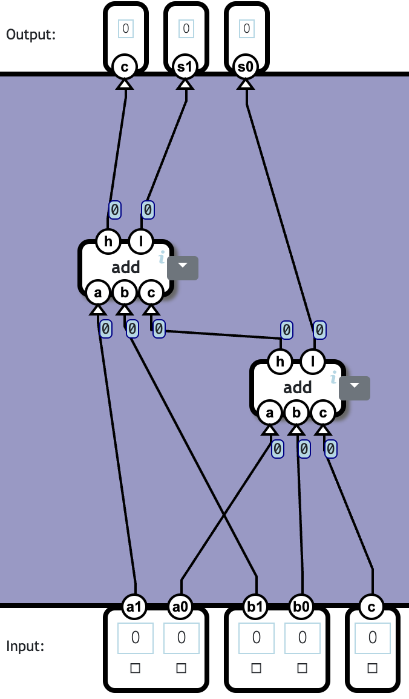
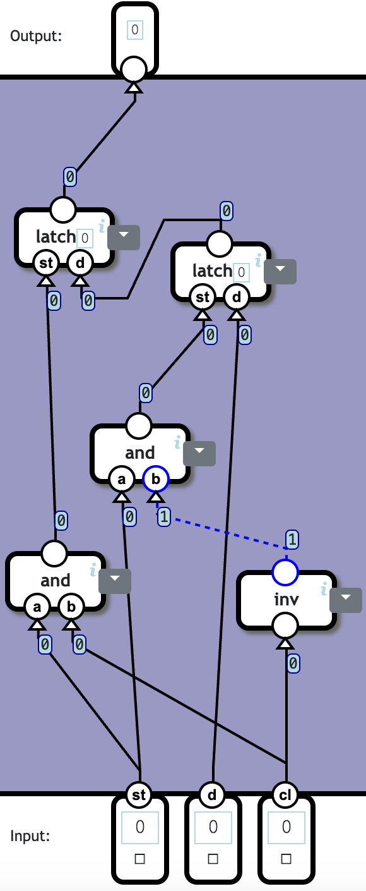

# NandGame

Solutions for The Nand Game, a game that teaches the fundamentals of computing by building a computer from scratch. Each level is accompanied by images of the logic gates used to build the components.

## Levels

## Logic Gates

### NAND Gate

2 components used. This is the simplest possible solution!

### Invert

1 component used. 1 NAND gate in total. This is optimal!

### AND Gate

2 components used. 2 NAND gates in total. This is optimal!

### OR Gate

3 components used. 3 NAND gates in total. This is optimal!

### XOR Gate

4 components used. 4 NAND gates in total. This is optimal!

## Arithmetic

### Half Adder

5 components used. 5 NAND gates in total. This is optimal!

### Full Adder

9 components used. 9 NAND gates in total. This is optimal!

### Multi-bit Adder

2 components used. 18 NAND gates in total. This is optimal!

### Increment

2 components used. (Not counting 0 which does not contain any logic.) 145 NAND gates in total. This is the simplest possible solution!

### Subtraction

3 components used. (Not counting 0 which does not contain any logic.) 161 NAND gates in total. This is the simplest possible solution!

### Equal to Zero

4 components used. 10 NAND gates in total. This is optimal!

### Less than Zero

0 components used. (Not counting splitter which does not contain any logic.) 0 NAND gates in total. This is the simplest possible solution!

## Switching

### Selector

4 components used. 4 NAND gates in total. This is optimal!

### Switch

4 components used. 4 NAND gates in total. This is optimal!

## Arithmetic Logic Unit

### Logic Unit

7 components used. 352 NAND gates in total. This is the simplest possible solution!

### Arithmetic Unit

5 components used. (Not counting 0 which does not contain any logic.) 434 NAND gates in total. This is the simplest possible solution!

### ALU

6 components used. (Not counting 0 which does not contain any logic.) 1042 NAND gates in total. This is the simplest possible solution!

### Condition

8 components used. (Not counting is neg which does not contain any logic.) 56 NAND gates in total. This is optimal!

## Memory

### Latch

1 component used. 4 NAND gates in total. This is optimal!

### Data Flip-Flop

5 components used. 13 NAND gates in total. This uses the fewest possible components. (But it is possible to solve with a lower total of NAND gates.)

### Register

2 components used. 26 NAND gates in total. This is the simplest possible solution!

### Counter

4 components used. (Not counting 0 which does not contain any logic.) 418 NAND gates in total. This is the simplest possible solution!

### RAM

4 components used. 484 NAND gates in total. This is the simplest possible solution!

## Processor

### Combined Memory

3 components used. 416 NAND gates in total. And 123904 for each kilobyte of RAM. This is the simplest possible solution!

### Instruction

3 components used. (Not counting splitter which does not contain any logic.) 1162 NAND gates in total.

### Control Unit

10 components used. (Not counting splitter and 0 which does not contain any logic.) 1297 NAND gates in total.

### Computer

4 components used. (Not counting clock which does not contain any logic.) 2131 NAND gates in total. And 123904 for each kilobyte of RAM. (ROM storage not counted) This is the simplest possible solution!

### Input and Output

3 components used. (Not counting lamp and button and bundler and splitter which does not contain any logic.) 6 NAND gates in total.

## Author

👤 **Aras Güngöre**

- LinkedIn: [@arasgungore](https://www.linkedin.com/in/arasgungore)
- GitHub: [@arasgungore](https://github.com/arasgungore)
