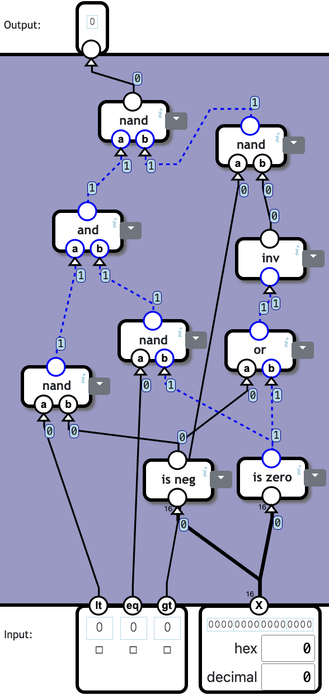

# NandGame

Solutions for The Nand Game, a game that teaches the fundamentals of computing by building a computer from scratch. Each level is accompanied by images of the logic gates used to build the components.

## Levels

## Logic Gates

### NAND Gate

### Invert
1 component, 1 NAND

### AND Gate
2 components, 2 NANDs

### OR Gate
3 components, 3 NANDs

### XOR Gate
3 components, 6 NANDs

## Arithmetic

### Half Adder
2 components, 6 NANDs

### Full Adder
3 components, 15 NANDs

### Multi-bit Adder
18 components, 18 NANDs

### Increment
2 components, 145 NANDs

### Subtraction
3 components, 161 NANDs

### Equal to Zero
4 components, 10 NANDs

### Less than Zero
0 components, 0 NANDs

## Switching

### Selector
4 components, 4 NANDs

### Switch
3 components, 5 NANDs

## Arithmetic Logic Unit

### Logic Unit
7 components, 352 NANDs

### Arithmetic Unit
4 components, 411 NANDs

### ALU
7 components, 669 NANDs

### Condition
8 components, 56 NANDs

## Memory

### Latch
1 component, 4 NANDs

### Data Flip-Flop
4 components, 11 NANDs

### Register
2 components, 18 NANDs

### Counter
4 components, 305 NANDs

### RAM
4 components, 260 NANDs

## Processor

### Combined Memory
3 components, 192 NANDs

### Instruction
3 components, 833 NANDs

### Control Unit
6 components, 923 NANDs

### Computer
5 components, 1248 NANDs

### Input and Output
2 components, 65 NANDs

## Author

👤 **Aras Güngöre**

- LinkedIn: [@arasgungore](https://www.linkedin.com/in/arasgungore)
- GitHub: [@arasgungore](https://github.com/arasgungore)
